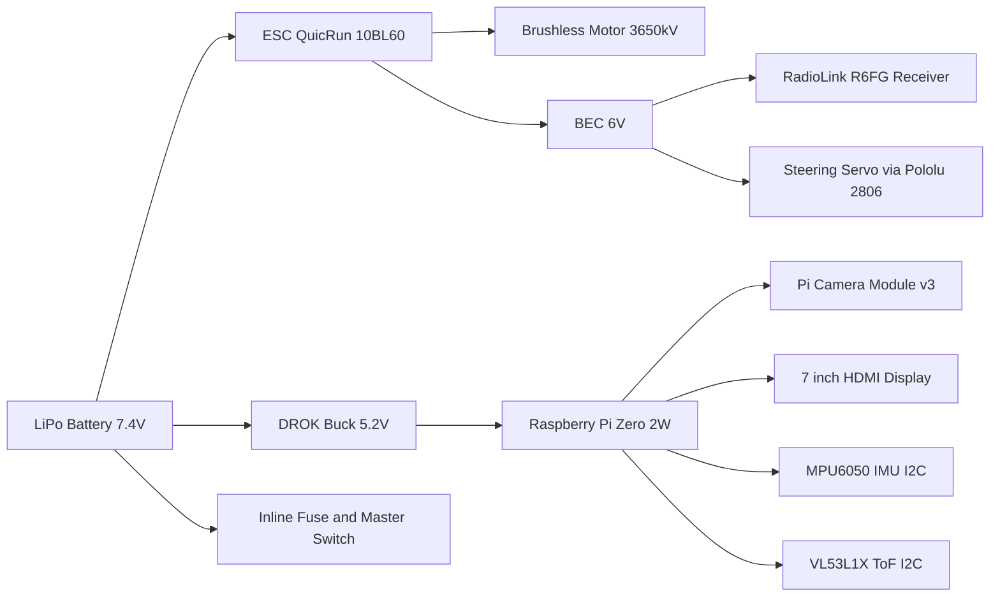

# Autonomous RC Car with AI Vision

An autonomous 1:10 scale RC car powered by a **Raspberry Pi Zero 2 W**, combining **embedded systems, computer vision, and robotics**.  
The car can drive manually via an **RC controller**, or autonomously using **AI-based vision** (lane following, stop sign & traffic light detection).  
A **Pololu multiplexer** ensures safe switching between manual and autonomous modes.

---

## Hardware Components

### Core
- Raspberry Pi 5 (4 GB) (onboard computer)
- Pi Camera Module v3 (vision)
- 7" HDMI Display 1024x600 (UI / "face")
- MPU-6050 (IMU: accelerometer + gyroscope)
- VL53L1X (ToF distance sensor)

### Drive & Control
- Surpass Hobby 3650kV Brushless Motor
- QuicRun WP 10BL60 Brushless ESC (60A)
- Miuzei 25 kg 270° Digital Servo (steering)
- RadioLink RC4GS v3 Transmitter + R6FG Receiver
- Pololu 2806 Servo Multiplexer (manual/autonomous switching)

### Power
- 5200 mAh Zeee 80C 2S LiPo (7.4V, 38.38 Wh)
- **DROK Adjustable Buck** (6–32 V in → 1.5–32 V out, **5 V / 5 A**), LCD + **USB-A port**
- **Compact 2S LiPo balance charger** (for charging via JST-XH balance plug)
- Inline fuse (30–40 A) + Master power switch
- XT60/Deans connectors + 14–18 AWG silicone wire

---

## System Architecture


---

## 🔌 Wiring Guide

### Power
- LiPo → **Inline Fuse** → **Master Switch** → split to **ESC** and **DROK Buck**  
- **DROK Buck (set 5.15–5.20 V)** → **Pi 5 5V/GND header** (short, thick leads; add 470–1000 µF low-ESR cap near Pi)
- **DROK USB-A** → 7" HDMI display/touch **USB power** (optional)
- ESC BEC (6 V) → **Receiver + Servo** (through Pololu 2806 outputs)

### Control Signals (via Pololu 2806)
- **Receiver CH1 (Steering)** → Pololu **IN A1**
- **Receiver CH2 (Throttle)** → Pololu **IN A2**
- **Pi GPIO18 (Steering PWM)** → Pololu **IN B1**
- **Pi GPIO12 (Throttle PWM)** → Pololu **IN B2**
- **Pololu OUT1 → Servo** (steering)
- **Pololu OUT2 → ESC** (throttle)
- **Pololu Select Line** → spare switch channel on RadioLink (manual vs autonomous)

### Raspberry Pi 5 GPIO Pinout

| Pi Pin # | GPIO # | Function     | Connected Device            |
|----------|--------|-------------|-----------------------------|
| 1        | 3.3V   | Power       | MPU-6050, VL53L1X           |
| 2 / 4    | 5V     | Power       | Pi, 7" Display (via buck)   |
| 3        | GPIO 2 | I²C SDA     | MPU-6050, VL53L1X           |
| 5        | GPIO 3 | I²C SCL     | MPU-6050, VL53L1X           |
| 6 / 9    | GND    | Ground      | Common ground (all devices) |
| 12       | GPIO18 | PWM (steer) | Pololu IN B1                |
| 32       | GPIO12 | PWM (throt) | Pololu IN B2                |
| CSI      | —      | Camera      | Pi Camera Module v3         |
| HDMI     | —      | Video Out   | 7" Display                  |

---

## 🔋 Power & Buck Setup (DROK LCD/USB)

1. Connect LiPo → **Fuse (30–40 A)** → **Master switch** → DROK **IN+/-** and ESC power.
2. With LiPo connected and **Pi disconnected**, set DROK output to **5.15–5.20 V**.
3. Wire DROK **OUT+/-** to the Pi 5 **5V/GND header** using **18–20 AWG**; keep leads short.
4. Add a **470–1000 µF low-ESR capacitor** across 5V/GND near the Pi header.
5. Use the DROK’s **USB-A** to power the **7" display** (USB), and HDMI for video.
6. **Prefer header power for the Pi** (some non-PD USB-C feeds can limit current).
7. Load test: camera + display + CV loop; if you see undervoltage, shorten/thicken leads or bump to **5.20 V** measured **at the Pi**.

---

## 🔌 Charging the 2S LiPo (Compact Charger)

1. Let the pack cool; inspect for puffing/damage. If damaged → **do not charge**.
2. Plug the **JST-XH 3-pin balance lead** into the charger’s **2S port**.
3. Place the pack in a **LiPo safe bag** on a non-flammable surface.
4. Start charge (most compact chargers are fixed ~0.8–1.5 A). Expect ~1–2.5 h.
5. Fully charged = **4.20 V/cell (8.40 V total)**; cells within ~0.01–0.03 V of each other.

### Storage & safety
- If not using for >48 h, leave near **3.8 V/cell (~7.6 V total)**.
- Never leave charging unattended.
- Keep away from flammables; use a LiPo bag.

### While driving (protect the pack)
- Set ESC **Low Voltage Cutoff** for **2S** (≈**3.2–3.4 V/cell under load**).
- Stop when resting voltage rebounds to **≈3.6–3.7 V/cell** (7.2–7.4 V total).

---
## 🧠 Software Stack (CPU-only)

- **OS**: Raspberry Pi OS (Bookworm)
- **Control**: `pigpio` (hardware PWM) or `PCA9685` (optional driver)
- **Computer Vision**: OpenCV (lane detection, HSV traffic light detection)
- **AI Models** (optional): TensorFlow Lite (tiny SSD/YOLO INT8 with XNNPACK)
- **Sensor Drivers**:
  - `smbus2` for I²C sensors (MPU-6050, VL53L1X)
  - `picamera2` for camera input
- **UI**: Python + Pygame/Tkinter on 7" HDMI screen

### Pi 5 setup (quick)

```bash
sudo apt update
sudo apt install -y python3-pip python3-opencv python3-smbus i2c-tools \
                    pigpio python3-pigpio python3-picamera2 libatlas-base-dev
sudo systemctl enable pigpio && sudo systemctl start pigpio

pip3 install --upgrade pip
pip3 install tflite-runtime smbus2 numpy
# Optional trackers
pip3 install filterpy onnxruntime
```
## Basic Control Loop (pseudo-code)

```python
while True:
    frame = camera.get_frame()
    lane_offset = detect_lane(frame)
    detections = detect_objects(frame)  # run sparsely

    throttle = BASE_SPEED
    steer = pid_control(lane_offset)

    if 'stop_sign' in detections and close_enough(detections['stop_sign']):
        throttle = 0

    tl = detections.get('traffic_light')
    if tl == 'red':
        throttle = 0

    distance = tof.read_mm()
    if distance is not None and distance < SAFE_DIST_MM:
        throttle = 0

    send_pwm(steer, throttle)
```

---

## Features
- Manual RC mode (RadioLink)  
- Autonomous mode (OpenCV + sensors)  
- Lane following with PID control  
- Stop sign & traffic light detection  
- Obstacle avoidance (ToF sensor)  
- On-screen UI (speed, detections, “face”)  
- Safe manual override via Pololu multiplexer  

---

## Stretch Goals
- Multi-car platooning (Wi-Fi UDP broadcasting)  
- AprilTag waypoint navigation  
- Map building with ORB-SLAM2 (Jetson Nano upgrade)  
- Personality UI (animated eyes/mouth on 7" display)  

---

## Safety
- Always test first with wheels lifted.  
- Use a 30–40 A inline fuse on the LiPo.  
- Never leave LiPo charging unattended.  
- Ensure **common ground** across ESC, Pi, receiver, and sensors.  

---

## Demo Ideas
- Record lane-following indoors with tape on the floor.  
- Print stop signs/traffic lights for detection demo.  
- Show manual/autonomous switch live via RC transmitter.  
- Overlay bounding boxes on 7" screen while driving.  

---

## Author
Built by **Vishit Soni** — Computer Engineering Student, University of Alberta.  
Demonstrates embedded systems, robotics, and applied machine learning.
